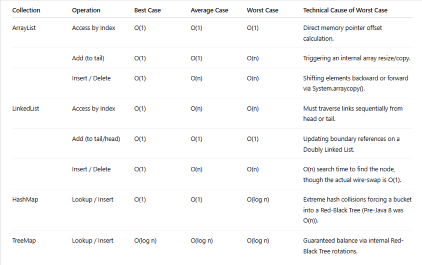

## 1. Explain internal structure of **HashMap (Node, TreeNode, resizing, threshold)**

To fully grasp the advanced mechanics of a `HashMap`, you have to look past the high-level API and examine the concrete nested classes and state variables defined within the JDK source code.

At its core, a `HashMap` transitions dynamically between structural types and handles mathematical scaling through the interaction of four pillars: **`Node`**, **`TreeNode`**, **`threshold`**, and the **`resize()`** method.

### 1. The Low-Level Components: `Node` vs. `TreeNode`

Inside a `HashMap`, every key-value pair is wrapped in an implementation of the `Map.Entry` interface. Depending on the density of bucket collisions, Java uses one of two structurally distinct inner classes:

#### A. `static class Node<K,V>` (The Singly Linked List Chain)

When a bucket has few collisions, it stores data using a standard, lightweight node.

```java
static class Node<K,V> implements Map.Entry<K,V> {
    final int hash;    // The calculated 32-bit hash code
    final K key;       // The user-supplied key
    volatile V val;    // The user-supplied value
    Node<K,V> next;    // A reference to the next node in the chain
}
```
-   **Memory Footprint:** Highly efficient. It contains exactly four reference pointers/primitives.

-   **Traversal Mechanics:** Singly linked. Java must step linearly from node to node ($O(n)$) matching keys via `.equals()`.


#### B. `static final class TreeNode<K,V>` (The Red-Black Tree Node)

When a bucket reaches `TREEIFY_THRESHOLD (8)` and total map capacity hits `64`, Java runs an internal conversion. It mutates the list nodes into an intricate tree structure extending `LinkedHashMap.Entry`.

```java
static final class TreeNode<K,V> extends LinkedHashMap.Entry<K,V> {
    TreeNode<K,V> parent;  // Red-Black Tree links
    TreeNode<K,V> left;
    TreeNode<K,V> right;
    TreeNode<K,V> prev;    // Needed to maintain sequential un-treeify linkage
    boolean red;           // Node color state flag for structural balancing
}
```

```java
static final class TreeNode<K,V> extends LinkedHashMap.Entry<K,V> {
    TreeNode<K,V> parent;  // Red-Black Tree links
    TreeNode<K,V> left;
    TreeNode<K,V> right;
    TreeNode<K,V> prev;    // Needed to maintain sequential un-treeify linkage
    boolean red;           // Node color state flag for structural balancing
}
```

-   **Memory Footprint:** Heavy. Due to tracking multiple tree links (`parent`, `left`, `right`) and a `boolean` color state, a `TreeNode` consumes roughly **double the memory** of a standard `Node`.

-   **Traversal Mechanics:** Binary Search Tree logic. Java traverses left or right based on relative hash codes, cutting search complexity down to a predictable **$O(\log n)$**.


### 2. The Scaling Engine: Capacity, Load Factor, and `threshold`

To manage memory versus performance tradeoffs, the `HashMap` relies on three internal values:

1.  **Capacity:** The total number of individual buckets in the underlying array (`table.length`). This value is **always a power of 2** (e.g., 16, 32, 64, 128) to allow for blindingly fast bitwise indexing operations.

2.  **Load Factor:** A floating-point ratio representing how full the map can get before it forces an expansion. The default value is **`0.75f`**, which balances time complexity against space overhead.

3.  **`threshold`:** The precise target entry count that triggers a structural expansion. It is calculated as:

    $$\text{threshold} = \text{Capacity} \times \text{Load Factor}$$


For example, a default `HashMap` starts with a capacity of `16` and a load factor of `0.75f`. The initial `threshold` is exactly **`12`**. The split second you insert your **13th element** into the map, it flags itself as overcapacity and forces a resize.

### 3. The `resize()` Mechanism: Deep Technical Breakdown

When the `threshold` is crossed, the map calls its internal `resize()` function. This is a complex $O(n)$ structural migration.

#### Step A: Double the Dimensions

Java allocates a brand-new internal array (`Node<K,V>[] newTable`) that is exactly **twice the size** of the current array. The new `threshold` variable is doubled as well.

#### Step B: The Index Mathematics Shift

When the capacity doubles, the formula used to calculate a node's bucket index ($\text{index} = \text{hash} \ \& \ (\text{capacity} - 1)$) changes because the bit-mask shifts left by exactly 1 bit.

-   For example, if a node's hash ends in binary `...10101`:

    -   Under capacity **16** ($\text{mask } 15 = \text{01111}$): Index is $\dots10101 \ \& \ 01111 = \mathbf{0101 \ (5)}$.

    -   Under capacity **32** ($\text{mask } 31 = \text{11111}$): Index is $\dots10101 \ \& \ 11111 = \mathbf{10101 \ (21)}$.


Notice that the index either **remains exactly the same (5)** or **shifts forward by exactly the old capacity (5 + 16 = 21)**.

#### Step C: The Java 8 High-Low Pointer Optimization

Before Java 8, resizing forced the map to completely recompute the hash index for every node and insert them sequentially, which inverted linked list chains.

Modern Java optimizes this by looping through each old bucket index once and separating the existing nodes into two distinct sub-lists using a clean bitwise check: `(e.hash & oldCap) == 0`.

```
[Old Bucket Index 5] ──► [Node A: Hash 5] ──► [Node B: Hash 21] ──► [Node C: Hash 37]

Split Logic via (hash & oldCap):
  - Node A (5 & 16 == 0)   ──► Classifies into the "Low List" (Stays at current index)
  - Node B (21 & 16 != 0)  ──► Classifies into the "High List" (Moves to current + oldCap)
  - Node C (37 & 16 == 0)  ──► Classifies into the "Low List" (Stays at current index)
```

Once sorted, the map hooks the heads of these two lists directly into their designated new slots:

-   **Low List Head:** Placed at `newTable[oldIndex]` (Index 5).

-   **High List Head:** Placed at `newTable[oldIndex + oldCap]` (Index 5 + 16 = 21).


By moving the entire sub-list as a single unified chain, Java preserves node execution order and completely avoids heavy re-indexing calculations.

### 4. Summary for High-Level Technical Context

-   **If a bucket contains a `Node` chain:** Resizing splits it cleanly into Low/High chains using bitwise filters.

-   **If a bucket contains a `TreeNode` tree:** Resizing splits the tree into two separate sub-trees. If a resulting sub-tree winds up containing **6 or fewer nodes** (`UNTREEIFY_THRESHOLD`), the map collapses the complex tree structure back down into a standard, memory-saving `Node` linked list.

