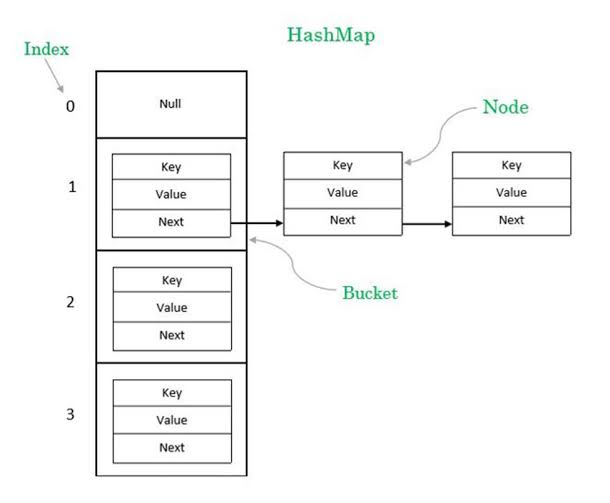
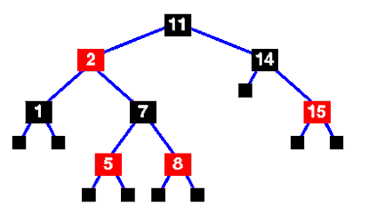

## 1. What is **bucket, hashing, rehashing**?

 **Hashing** is the mathematical process of converting an object (like a String, Integer, or custom object key) into a single integer value, known as a **hash code**.

 In Java, this happens when you invoke key.hashCode().
 - **The Goal:** Convert infinite variety (any text, any object state) into a manageable 32-bit integer.
 - **The Rule:** If two keys are identical according to equals(), they **must** yield the exact same hash code.


A **bucket** is a single element slot within the HashMap's underlying array. If the internal array has a capacity of 16, it contains 16 individual buckets numbered from index 0 to 15.

As you can see in the diagram below, a bucket isn't just a restricted slot that holds one single value; it is the entry point to a data structure (a **Node** chain).



**Rehashing** is the process of doubling the internal array capacity and redistribution of all existing data nodes across the new, larger bucket layout.

 ***Why does it happen?*** If you keep shoving entries into a fixed-size array, the buckets will accumulate long linked lists or trees. Your fast $O(1)$ lookup performance will degrade toward a sluggish $O(n)$. To prevent this, Java sets a ceiling based on the **Load Factor**:

$$\text{Threshold} = \text{Current Capacity} \times \text{Load Factor (default 0.75)}$$

When the number of stored entries crosses this threshold, it triggers an emergency expansion.

***What happens during the process?***

1.  **New Array Creation:** Java creates a brand-new internal array that is exactly **twice** the size of the old one (e.g., from 16 buckets to 32 buckets).

2.  **Re-calculating Addresses:** Because the array size has changed, the index formula ($\text{hash} \ \& \ (\text{capacity} - 1)$) yields entirely different results for the old keys.

3.  **Redistribution:** Java loops through every single old bucket, tracks down every linked node, and moves it to its brand-new calculated bucket index in the expanded array.


> **Interview Note:** Rehashing is a highly expensive $O(n)$ operation because every single entry must be touched and re-mapped. If you know you will be storing 1,000 items in your map, initialize it with a defined capacity (new HashMap<>(1334)) to completely avoid the overhead of multiple on-the-fly rehashings.


## 2. Why does HashMap convert **LinkedList → Tree (Red-Black Tree)**?


The short answer is **security and performance**. Java converts long linked lists inside buckets into Red-Black Trees to protect applications from **DoS (Denial of Service) attacks** and to keep performance from degrading when bad code is written.

Here is the breakdown of why this architectural change was introduced in Java 8.

### 1. The Nightmare Scenario: $O(n)$ Collapse

Before Java 8, when multiple keys collided in the same bucket, they were stored in a simple singly linked list.

-   **Best-case scenario ($O(1)$):** Keys are perfectly distributed. Every bucket has zero or one node. Lookups are instant.

-   **Worst-case scenario ($O(n)$):** If every single key inserted into the map maps to the **exact same bucket**, the HashMap functionally degrades into one long linked list. To find an element at the end of that list, Java has to traverse every single node one by one using .equals().


### 2. The Security Threat: Hash Collision Attacks

This worst-case scenario wasn't just a theoretical performance issue—it was a critical security vulnerability known as a **Hash Collision DoS Attack**.

Imagine a web application that accepts user data (like JSON payloads or API query parameters) and parses those keys into a HashMap. If an attacker figures out how your language handles hashing, they can deliberately generate thousands of different string keys that produce the exact same hash code.

`Attacker Keys: "AaAa", "BBBB", "AaBB", "BBAa" ... (all share the same hash)`

If they send an API request with 10,000 of these colliding keys:

1.  Pre-Java 8 HashMap would force all 10,000 items into a single bucket's linked list.

2.  Inserting each item would require traversing the growing list to check for duplicates, requiring millions of comparisons ($O(n^2)$ total work).

3.  The server's CPU usage would spike to 100% just trying to parse a single incoming request, easily knocking the entire web application offline.


### 3. The Java 8 Solution: Red-Black Trees

To neutralize this weapon, Java 8 introduced **Treeification**.

When a single bucket's linked list grows past **8 elements** (TREEIFY_THRESHOLD) and the overall map capacity is at least **64** (MIN_TREEIFY_CAPACITY), Java structurally mutates the nodes in that bucket from a flat Node list into a balanced **Red-Black Tree** made of TreeNode instances.

```
[Singly Linked List]                [Red-Black Tree]
  (Lookup: O(n))                    (Lookup: O(log n))

   [Node 1]                             [Node 4]
      │                                /        \
   [Node 2]                        [Node 2]   [Node 6]
      │                            /      \   /      \
   [Node 3] ...                 [Node 1][Node 3][Node 5][Node 7]
```

### 4.The Performance Math

A balanced Red-Black tree guarantees that the worst-case lookup, insertion, and deletion time is capped at **$O(\log n)$**.

Look at how the math changes if an attacker jams 10,000 colliding elements into one bucket:

-   **Linked List ($O(n)$):** Up to **10,000 operations** per lookup.

-   **Red-Black Tree ($O(\log n)$):** Maximum of about **14 operations** ($\log_2(10000) \approx 13.29$) to find any element.


By switching to a tree, Java forces the worst-case performance to stay incredibly fast, making Hash Collision DoS attacks completely ineffective.

### 5. Why not use Trees for _everything_ from the start?

If trees are so fast in the worst-case, you might wonder why Java doesn't just use them for every bucket right away. There are two primary reasons:

1.  **Memory Overhead:** A standard Node in a HashMap only needs pointers to its key, value, hash, and the next node. A TreeNode has to maintain pointers to its left child, right child, parent node, and track its red/black color balance flag. TreeNode instances consume roughly **twice the memory** of standard list nodes.

2.  **The Probability Factor:** Under normal real-world conditions with a well-distributed hashCode() function, the mathematical probability of a bucket reaching 8 elements on its own is less than 1 in 10 million.


Java uses lists by default to save massive amounts of memory, but switches to trees exclusively as an emergency defense mechanism when things go wrong.

## 3. Difference between **ConcurrentHashMap vs HashMap**?

The core difference between HashMap and ConcurrentHashMap comes down to **Thread Safety** and **Performance**. While HashMap is built for maximum speed in single-threaded environments, ConcurrentHashMap is engineered to handle aggressive, multi-threaded access without crashing your application or locking up your CPU.
Here is the direct breakdown of how they compare across architectural and operational lines.

### 1. The Core Differences
|  Feature |  HashMap | ConcurrentHashMap  |
|---|---|---|
|  Thread Safety |**No**. Multiple threads modifying it simultaneously will corrupt internal state.   | **Yes**. Fully thread-safe for safe concurrent reads and writes.  |
|  Locking Mechanism |  None | **Bucket-level locking** (Java 8+ uses fine-grained synchronization and CAS operations).  |
|   Null Keys / Values|  **Allowed**. Can have one null key and multiple null values. |  **Forbidden**. Attempting to pass null throws a NullPointerException. |
| Iterator Behavior  | **Fail-Fast**. Throws ConcurrentModificationException if modified during iteration.  | **Fail-Safe / Weakly Consistent**. Safely iterates over a snapshot; won't throw exceptions if modified.  |
|  Performance |   Blindingly fast for a single thread; no synchronization overhead.|  Slightly more overhead than HashMap, but infinitely faster than Collections.synchronizedMap(). |


### 2. Under the Hood: How They Handle Concurrency

To appreciate why ConcurrentHashMap is so powerful, you have to look at how it handles multi-threaded access compared to older synchronization methods.

#### The Old, Bad Way (Collections.synchronizedMap)

Older Java architectures achieved thread safety by wrapping a standard HashMap in a synchronized wrapper. This uses a **global lock**. If Thread A is reading a value, Thread B, C, and D are entirely blocked from accessing _any_ part of the map. It creates a massive performance bottleneck.

#### The Modern Way (ConcurrentHashMap in Java 8+)

ConcurrentHashMap uses **Fine-Grained Bucket Locking**. Instead of locking the entire map, it only locks the specific **bucket** you are trying to write to.

-   **Concurrent Reads ($O(1)$):** Reading data (map.get()) requires **no locking at all**. Multiple threads can read from the exact same bucket simultaneously without blocking each other.

-   **Concurrent Writes:** If Thread 1 wants to update data in Bucket 2, and Thread 2 wants to update data in Bucket 7, they proceed **simultaneously** with zero blocking.

-   **CAS (Compare-And-Swap):** If a bucket is empty, Java won't even use a heavy synchronized lock to insert a node. It uses low-level, CPU-native atomic instructions (CAS) to safely insert the node lock-free. It only falls back to a targeted synchronized lock on the head node if a collision occurs within that specific bucket chain.


### 3. Why are Nulls Forbidden in ConcurrentHashMap?

A classic interview trick question is: _"Why does HashMap allow null keys/values, but ConcurrentHashMap does not?"_

The answer is **Ambiguity in a Multi-threaded Environment**.

In a standard HashMap, if map.get("key") returns null, you can call map.containsKey("key") to determine if the key was missing or if the value was explicitly mapped to null.

In a concurrent environment, this breaks down. If a thread calls map.get("key") and gets null, it cannot safely verify if the key was missing or explicitly null. In the split second between calling get() and checking containsKey(), another background thread could have deleted or modified that key. To eliminate this critical ambiguity, null keys and values are strictly banned.

### 4. Iterator Mechanics: Fail-Fast vs. Fail-Safe

The way these maps handle loop iterations reveals their underlying structural differences:

-   **HashMap (Fail-Fast):** Uses an internal structural modification counter. If you try to iterate through a HashMap and use map.put() or map.remove() inside the loop from another thread (or even the same thread without using the iterator directly), it immediately throws a ConcurrentModificationException.

-   **ConcurrentHashMap (Fail-Safe / Weakly Consistent):** Its iterators are designed for concurrent environments. They reflect the state of the map at the moment the iterator was constructed. If elements are added or removed after the loop starts, the iterator handles it gracefully without throwing any exceptions.


## 4. How does **ConcurrentHashMap achieve thread safety?

`ConcurrentHashMap` undergoes a massive architectural shift between Java 7 and Java 8+. In modern Java (Java 8 through Java 21+), it achieves thread safety through a highly optimized combination of **Lock-Free Read Operations**, **Atomic CAS (Compare-And-Swap) Mutations**, and **Fine-Grained Bucket-Level Locking**.

Instead of locking the entire data structure, it applies the absolute minimum amount of synchronization required to complete an operation safely.

Here is the step-by-step breakdown of how this mechanism operates under the hood.

### 1. Volatile Variables (Lock-Free Reads)

The first rule of `ConcurrentHashMap` performance is: **Reading data (`get()`) requires absolutely zero locks.**

To make this safe across multiple CPU cores, the underlying array of buckets and the internal pointers of each node are declared using the `volatile` keyword:

```java
transient volatile Node<K,V>[] table; // The main bucket array

static class Node<K,V> implements Map.Entry<K,V> {
    final int hash;
    final K key;
    volatile V val;             // Volatile value pointer
    volatile Node<K,V> next;    // Volatile next-node pointer
}
```

-   **The Mechanics:** The `volatile` modifier tells the JVM and the CPU hardware never to cache these fields inside local CPU registers or L1/L2 caches.

-   **The Benefit:** Any write operation performed by Thread A on a node's value or its `next` pointer is instantly visible to Thread B reading that same node. Because of this guaranteed hardware-level memory visibility, reads can run concurrently at full speed without using synchronized blocks.

### 2. Compare-And-Swap / CAS (Lock-Free Initial Writes)

When you attempt to write to a bucket using `put()`, Java first checks if that specific bucket slot is currently empty. If it is empty, Java avoids heavy thread synchronization entirely. Instead, it utilizes low-level, CPU-native atomic instructions called **CAS (Compare-And-Swap)** via the internal `Unsafe` or `VarHandle` API.

```
Thread A wants to insert a node at index [4].
Index [4] is currently empty (null).

   ┌────────────────────────────────────────────────────────┐
   │ CAS Instruction: "If index [4] is still null,          │
   │                   atomically swap null with New Node." │
   └────────────────────────────────────────────────────────┘
                               │
            ┌──────────────────┴──────────────────┐
            ▼                                     ▼
     [Success Path]                         [Failure Path]
If true, node is inserted instantly.   If false (another thread sneaked in),
No thread lock was ever created.       CAS fails; loop retries smoothly.
```

Because CAS operations happen directly at the CPU hardware level, they execute cleanly without putting threads into a suspended or blocked OS state.

### 3. Fine-Grained Bucket Locking (Targeted Synchronization)

If you attempt to write to a bucket that **already contains elements** (meaning a hash collision has occurred, and a linked list or Red-Black Tree is present), Java cannot safely use a single CAS operation. It must fall back to standard synchronization—but it does so with surgical precision.

Instead of locking the entire map, Java uses the standard `synchronized` keyword to lock **only the single head node** of that specific bucket chain.

```
Bucket Array:  [0]     [1]     [2]     [3]     [4] (Locked)
                │       │       │       │       │
              Node    Node    Node    Node    [Head Node] ◄── Thread 1 locks ONLY this head node
                                                │
                                              Node B
                                                │
                                              Node C
```

-   **The Mechanics:** Thread 1 acquires a lock on the head node of Bucket `4`.

-   **The Concurrency Win:** While Thread 1 is busy modifying or appending a node inside Bucket `4`, Thread 2 can seamlessly write into Bucket `2`, Thread 3 can write into Bucket `3`, and dozens of other threads can read from Bucket `4` simultaneously.

-   **The Scope reduction:** By minimizing the scope of the lock down to a single bucket chain, the map minimizes thread contention down to almost nothing under balanced loads.


### 4. Smart Concurrent Resizing

When the total entry count crosses the threshold, the table must expand and double its size. In a standard `HashMap`, this operation freezes or breaks multi-threaded environments.

`ConcurrentHashMap` handles this via a multi-threaded cooperative system called **Concurrent Resizing**:

-   When a thread triggers a resize, it allocates a new table and marks buckets in the old table with a special forwarding node (`ForwardingNode`).

-   If other threads attempt a `put()` operation and land on a bucket marked with a `ForwardingNode`, they don't block blindly. Instead, they actively **help copy nodes** over to the new array.

-   Once the collective migration finishes, the map updates the root reference to the new table.


### 5. Summary: The Java 7 vs. Java 8 Structural Shift

If asked about this in an interview, concluding with this structural contrast shows deep knowledge of the framework's evolution:

| Evolution Vector  | Java 7 Implementation  |  Java 8+ Implementation |
|---|---|---|
|  Core Architecture |  Segment Locking (Segment<K,V>[]). The map was explicitly partitioned into 16 separate segments, each acting as an individual locked table. | Bucket Array + Treeification. The segment layer was completely removed. It uses a flat array of standard nodes that dynamically transform into trees.  |
| Concurrency Level  | Capped explicitly by the number of segments (default 16). Maximum 16 writing threads.  | Scalable completely with the array capacity. If the array has 512 buckets, up to 512 threads can write simultaneously.  |
|Lock Mechanism   | Explicitly extended ReentrantLock wrappers.  |  Native CPU CAS operations combined with standard built-in synchronized blocks on head nodes. |


## 5. What is **fail-fast vs fail-safe iterator**?

The fundamental difference between **Fail-Fast** and **Fail-Safe** iterators is how they respond when the underlying collection is modified (elements added, removed, or updated) while a loop is actively running.

A **Fail-Fast** iterator panics and throws an exception immediately to prevent data corruption. A **Fail-Safe** iterator is designed to tolerate concurrent modifications gracefully.

### 1. Fail-Fast Iterators (The Strict Guardians)

Fail-fast iterators operate directly on the collection's live, raw data structure. They do not tolerate structural modifications while you are looping through them.

-   **The Trigger:** If a thread alters the structure of the collection while an iterator is processing elements, the iterator will instantly throw a **`ConcurrentModificationException`**.

-   **How it works under the hood:** The collection maintains an internal tracker variable called `modCount` (modification count). Every time you call `list.add()` or `list.remove()`, this counter increments. When you create an iterator, it copies this value into an expected modification flag (`expectedModCount`). On every single loop iteration (`iterator.next()`), the iterator checks:

    $$\text{if } (modCount \neq expectedModCount) \implies \text{Throw Exception}$$

-   **Default implementations:** Most standard collections in the `java.util` package use fail-fast iterators, including `ArrayList`, `HashSet`, and `HashMap`.

```java
List<String> list = new ArrayList<>(List.of("Apple", "Banana", "Cherry"));

for (String fruit : list) { // Under the hood, this uses an Iterator
    if (fruit.equals("Banana")) {
        list.remove(fruit); // 💥 BOOM! This increments modCount
    }
}
// Output: Throws java.util.ConcurrentModificationException on the next loop turn
```

> **The Fix:** If you need to remove elements while iterating through a fail-fast collection, you must bypass the collection itself and call the iterator's own removal hook directly: `iterator.remove()`. This safely updates both counters simultaneously.

### 2. Fail-Safe Iterators (The Resilient Operators)

In Java documentation, these are formally referred to as **Weakly Consistent Iterators**. They are engineered to handle structural changes without blowing up your application.

-   **The Strategy:** They avoid exceptions by avoiding the live data. Most fail-safe iterators operate on an independent **cloned snapshot** or a separate segment of the data structure created at the moment the iterator was initialized.

-   **The Tradeoff:** Because they loop through a snapshot, they are _weakly consistent_. This means if you add or remove items while the loop is running, the loop might not reflect those real-time changes.

-   **Default implementations:** Found primarily within the `java.util.concurrent` package, including `CopyOnWriteArrayList`, `ConcurrentHashMap` (key/value iterators), and `CopyOnWriteArraySet`.


### 3. ✅ Fail-Safe Code Example
```java
List<String> safeList = new CopyOnWriteArrayList<>(List.of("Apple", "Banana", "Cherry"));

for (String fruit : safeList) {
    if (fruit.equals("Banana")) {
        safeList.remove(fruit); // 🦾 Totally fine! No exception thrown.
    }
}
System.out.println(safeList); 
// Output: [Apple, Cherry] (The live array updated, but the loop safely finished using its snapshot)
```

📊 Side-by-Side Comparison

| Feature  | Fail-Fast Iterator  | Fail-Safe (Weakly Consistent) Iterator  |
|---|---|---|
|  Throws Exception? | **Yes** (`ConcurrentModificationException`)  | **No**. Handles modifications smoothly.  |
| Data Source  |  Operates directly on the **live collection data**. | Operates on a **cloned copy / snapshot** or uses memory views.  |
|  Memory Overhead |  **Low**. No data cloning or memory duplication required. |  **High** (especially `CopyOnWriteArrayList` which copies the entire array on every single mutation). |
|  Real-time Accuracy |  High (guarantees you aren't reading stale data). |   Lower (may not show items modified after the iterator was born).|
| Typical Package  | `java.util` (`ArrayList`, `HashMap`, `HashSet`)  | `java.util.concurrent` (`ConcurrentHashMap`, `CopyOnWriteArrayList`)  |


## 6. What is **Iterator vs ListIterator**?


Both `Iterator` and `ListIterator` are core interfaces in the Java Collections Framework used to traverse collections. However, `ListIterator` is a specialized, upgraded sub-interface designed **exclusively for lists** (`ArrayList`, `LinkedList`).

Think of `Iterator` as a basic one-way street, while `ListIterator` is a feature-rich two-way highway.

### 1. Directional Control

-   **`Iterator` (Forward Only):** It can only move forward through a collection. Once you advance past an element using `next()`, you cannot go back.

-   **`ListIterator` (Bidirectional):** It can traverse a list in both directions. It provides `hasPrevious()` and `previous()` hooks alongside `hasNext()` and `next()`.

```
Iterator: [Node 1] ─────────────► [Node 2] ─────────────► [Node 3] ListIterator: [Node 1] ◄────────────► [Node 2] ◄────────────► [Node 3]
```

### 2. Structural Modifications

-   **`Iterator` (Read + Remove):** While looping, you can read elements and safely remove them using `iterator.remove()`. You cannot add new elements or modify existing ones.

-   **`ListIterator` (Read + Remove + Add + Modify):** It gives you full control over the underlying structure while iterating.

    -   `add(E e)`: Inserts an element immediately before the element that would be returned by `next()`.

    -   `set(E e)`: Replaces the last element returned by `next()` or `previous()` with a new object.


### 3. Position Tracking (Indexing)

-   **`Iterator`:** Has no concept of where it is in terms of an index number. It only knows if there is a "next" item.

-   **`ListIterator`:** Can tell you the exact index positions of surrounding items using `nextIndex()` and `previousIndex()`. This is highly useful for algorithms where tracking offsets matters.


### 4. 📊 Side-by-Side Comparison

| Feature  |  Iterator | ListIterator  |
|---|---|---|
|  Applicability | Can be used on **any** `Collection` (`List`, `Set`, `Queue`, etc.).  |  Can **only** be used on `List` implementations. |
| Traversal Direction  |  Forward only. | Bidirectional (Forward and Backward).  |
|  Core Methods |  `hasNext()`, `next()`, `remove()` | All `Iterator` methods + `hasPrevious()`, `previous()`, `add()`, `set()`, `nextIndex()`, `previousIndex()`.  |
| Modification Capabilities  | Can only **remove** elements during iteration.   |  Can **remove, add, and replace/set** elements during iteration. |

### 5. 💻 Code Example: The Power of ListIterator

Here is a practical look at how `ListIterator` lets you modify and reverse-traverse a list on the fly:
```java
import java.util.ArrayList;
import java.util.List;
import java.util.ListIterator;

public class IteratorDemo {
    public static void main(String[] args) {
        List<String> names = new ArrayList<>(List.of("Amit", "Richa", "Tom"));
        ListIterator<String> lit = names.listIterator();

        System.out.println("--- Modifying while moving Forward ---");
        while (lit.hasNext()) {
            String name = lit.next();
            if (name.equals("Tom")) {
                lit.set("Saha"); // Modifies "Tom" to "Saha" on the fly
                lit.add("NewUser"); // Safely injects a new element right after
            }
        }
        System.out.println("Modified List: " + names); 
        // Current state: [Amit, Richa, Saha, NewUser]

        System.out.println("\n--- Traversing Backward ---");
        // The iterator pointer is currently at the very end of the list
        while (lit.hasPrevious()) {
            System.out.println("Index " + lit.previousIndex() + ": " + lit.previous());
        }
    }
}
```
Output
```
--- Modifying while moving Forward ---
Modified List: [Amit, Richa, Saha, NewUser]

--- Traversing Backward ---
Index 3: NewUser
Index 2: Saha
Index 1: Richa
Index 0: Amit
```


## 7.Difference between **Comparable vs Comparator**?


The core difference between `Comparable` and `Comparator` comes down to **intent and ownership**: `Comparable` defines the _default, natural sorting order_ for a class, while `Comparator` defines _custom, alternative sorting orders_ externally.

Think of `Comparable` as a class saying, _"This is how I naturally sort myself,"_ and `Comparator` as a third-party referee saying, _"For this specific scenario, let's sort these objects this way."_

### 1. The Core Differences
|  Feature | Comparable  |  Comparator |
|---|---|---|
|  Interface Package |  java.lang.Comparable | java.util.Comparator  |
|  Sorting Method |   public int compareTo(T o)| public int compare(T o1, T o2)  |
|  Class Modification |  **Yes**. You must modify the source code of the class to implement it. | **No**. You write it as a separate class, lambda expression, or anonymous inner class.  |
|  Number of Strategies|  **One**. A class can only have a single `compareTo` implementation (Natural Order). | **Multiple**. You can create as many comparators as you want (e.g., sort by age, sort by price).  |
|  Typical Use Case | Default sorting for foundational classes like `String`, `Integer`, or basic domain models.  |  Sorting custom objects in tables, custom sorting logic, or sorting classes you don't own (like third-party library classes). |


### 2. Understanding the Return Mechanics

Both interfaces rely on an `int` output to make sorting decisions. The contract for both `compareTo(o)` and `compare(o1, o2)` is identical:

-   **Negative Value (`less than 0`):** The first element is smaller. Keep it _before_ the second element.

-   **Zero (`0`):** Both elements are equal.

-   **Positive Value (`greater than 0`):** The first element is larger. Swap them, moving the first element _after_ the second element.


### 3. Real-World Code Implementation

Let's say we have an `Employee` class. Naturally, employees should be sorted by their unique `id`. However, HR occasionally wants to sort them by `name` or `salary`.

Here is how you handle both scenarios:


```java
import java.util.ArrayList;
import java.util.Collections;
import java.util.Comparator;
import java.util.List;

// 1. Implementing Comparable for NATURAL SORTING ORDER (by ID)
class Employee implements Comparable<Employee> {
    private int id;
    private String name;
    private double salary;

    public Employee(int id, String name, double salary) {
        this.id = id;
        this.name = name;
        this.salary = salary;
    }

    public int getId() { return id; }
    public String getName() { return name; }
    public double getSalary() { return salary; }

    @Override
    public int compareTo(Employee other) {
        // Natural sort by ID ascending
        return Integer.compare(this.id, other.id);
    }

    @Override
    public String toString() {
        return "[" + id + ", " + name + ", ₹" + salary + "]";
    }
}

public class SortingDemo {
    public static void main(String[] args) {
        List<Employee> employees = new ArrayList<>();
        employees.add(new Employee(103, "Amit", 95000));
        employees.add(new Employee(101, "Richa", 120000));
        employees.add(new Employee(102, "Tom", 80000));

        // --- 1. Natural Sort via Comparable ---
        Collections.sort(employees);
        System.out.println("Sorted by ID (Comparable):\n" + employees);

        // --- 2. Custom Sort via Comparator (Lambda: Sort by Name) ---
        employees.sort((e1, e2) -> e1.getName().compareTo(e2.getName()));
        System.out.println("\nSorted by Name (Comparator Lambda):\n" + employees);

        // --- 3. Modern Java Cleanest Approach (Using Comparator.comparing) ---
        employees.sort(Comparator.comparingDouble(Employee::getSalary).reversed());
        System.out.println("\nSorted by Salary Descending (Modern Comparator):\n" + employees);
    }
}
```
Output

### 4. Modern Java Pro-Tips for Interviews 💡

1.  **Avoid Raw Math Subtraction Traps:** A classic, old-school shortcut for sorting integers or doubles was `this.id - other.id`. **Never do this.** If `this.id` is a massive positive integer and `other.id` is a massive negative integer, the subtraction can overflow/underflow the 32-bit integer boundaries, flipping the sign and breaking your sorting algorithm. Always use `Integer.compare()` or `Double.compare()`.

2.  **Chaining Comparators:** Modern Java allows you to chain sorting conditions effortlessly using `.thenComparing()`. For instance, if you want to sort employees by name, and if names are identical, break the tie by salary:

```java
employees.sort(Comparator.comparing(Employee::getName)
                         .thenComparingDouble(Employee::getSalary));
```

### 5. Practical Implementation: `CompareSortCollection.java`

This example demonstrates how to use `Comparable` for natural ordering (rating) and `Comparator` for custom ordering (earnings).

```java
    static class Movies implements Comparable<Movies> {
        String id;
        String name;
        int earnings;
        float rating;

        public Movies(String id, String name, int earnings, float rating) {
            this.id = id;
            this.name = name;
            this.earnings = earnings;
            this.rating = rating;
        }

        @Override
        public String toString() {
            return "{" + id + "." + name + ", rating='" + rating + ", earnings='" + earnings + "}/\n";
        }


        @Override
        public int compareTo(Movies o) {
            return Float.compare(this.rating, o.rating);
        }
    }


    public static void main(String[] args) {
        var movies = generateMoviesList();
        System.out.println("Unsorted Movie List->\n" + movies);
        Collections.sort(movies);
        System.out.println("Sorted movie list based on rating->\n" + movies);
        Collections.sort(movies, new EarningComparator());
        System.out.println("Sorted movie list based on earning->\n" + movies);
    }

    public static List<Movies> generateMoviesList() {
        List<Movies> moviesList = new ArrayList<>();
        moviesList.add(new Movies("1", "No Country for old men", 300_000, 9.3f));
        moviesList.add(new Movies("2", "Shawshank redemption", 30_000, 9.8f));
        moviesList.add(new Movies("3", "Transformer", 30_000_000, 4.8f));
        moviesList.add(new Movies("4", "Avatar", 300_000_000, 6.8f));
        return moviesList;
    }
    
    static class EarningComparator implements Comparator<Movies> {
    
        @Override
        public int compare(Movies o1, Movies o2) {
            return o1.earnings - o2.earnings;
        }
    }
```

```
<FollowUp label="Want to look at TreeMap or PriorityQueue under the hood next?" query="Explain how TreeMap or PriorityQueue work internally in Java collections."/>                         
```

## 8. What is **TreeMap**? How is it sorted?

A `TreeMap` is a specialized map implementation in Java that stores its key-value pairs in a **strictly sorted order based on the keys**.

Unlike `HashMap` (which uses hashing and is completely unordered) or `LinkedHashMap` (which maintains insertion order), a `TreeMap` dynamically sorts your elements the moment you insert them.

### 1. How is it Sorted? (The Sorting Mechanism)

A `TreeMap` sorts its keys using one of two strategies:

#### Strategy A: Natural Ordering (Default)

If you do not pass anything into the constructor, `TreeMap` assumes the keys implement the `Comparable` interface. It will invoke `key1.compareTo(key2)` behind the scenes to arrange the entries. Basic Java types like `String`, `Integer`, and `Date` already implement this naturally.

####  Strategy B: Custom Ordering (via a Comparator)

If you want an alternative sorting order or are using a custom class that does not implement `Comparable`, you can supply a custom `Comparator` directly to the `TreeMap` constructor:

```java
// Keys will be sorted alphabetically in descending order
TreeMap<String, Integer> reverseMap = new TreeMap<>(Comparator.reverseOrder());
```

### 2. Under the Hood: The Red-Black Tree Architecture

A `TreeMap` does _not_ use a hash-bucket array. Instead, it is built entirely as a **Red-Black Tree** (a self-balancing binary search tree).



#### How Data Moves into the Tree

When you put a new key-value pair into the map, Java walks down the tree starting at the root node (like node `11` in the diagram):

1.  It compares your new key against the current node's key using the designated comparison strategy.

2.  If your key is **smaller**, it moves down to the **left child** (e.g., toward node `2`).

3.  If your key is **larger**, it moves down to the **right child** (e.g., toward node `14`).

4.  It repeats this comparison recursively until it finds an empty spot to attach the new node.

5.  **Self-Balancing:** If the tree gets visually lopsided during an insertion or deletion, the internal code automatically triggers rotations and recolors the nodes (switching between red and black states) to keep the depth of the tree balanced.


#### Why the Balance Matters

Because it forces the tree to remain balanced, the depth of the tree is strictly capped at roughly $\log_2(n)$. This guarantees a predictable, consistent time complexity for basic operations:

$$\text{Insertion, Deletion, and Lookup Time Complexity} = O(\log n)$$

While this is slower than `HashMap`'s average $O(1)$ time, it avoids the $O(n)$ collapse risk entirely and keeps everything instantly queryable in perfect sorted sequence.

### 3. Crucial Edge Case Traps for Interviews

#### Trap 1: The Null Key Ban

A standard `HashMap` allows a single `null` key. **`TreeMap` strictly forbids null keys.**

If you try to execute `treeMap.put(null, "value")`, Java will instantly crash with a `NullPointerException`. Why? Because to figure out where to place a node in the tree, Java has to call `.compareTo()` or `.compare()`. You cannot run a comparison method on a `null` reference.

#### Trap 2: Uniqueness depends entirely on the Comparator, NOT `equals()`

This is a massive trick question. For a `HashMap`, uniqueness is determined by `hashCode()` and `equals()`. For a `TreeMap`, uniqueness is determined **exclusively by the comparison method returns**.

If your comparator or `compareTo` method returns `0` for two different objects, the `TreeMap` considers them duplicate keys. It will overwrite the old value, even if the two objects are completely unequal according to their `.equals()` method.

####  4. When to Choose TreeMap over HashMap

Use a `TreeMap` when your application requires more than just standard key-value fetches:

-   **Range Queries:** Fetching sub-segments of data (e.g., "Give me all entries where the keys fall between 'B' and 'M'"). `TreeMap` provides specialized methods for this like `subMap()`, `headMap()`, and `tailMap()`.

-   **Proximity Searches:** Finding close matches. Methods like `higherKey(key)` (next element up) or `floorKey(key)` (next element down) let you step smoothly through data thresholds.


## 9. What is **PriorityQueue** and how does it work?


A `PriorityQueue` is an unbounded queue implementation where elements are processed based on their **priority**, rather than their standard FIFO (First-In, First-Out) order.

Think of a standard queue like a line at a grocery checkout—first come, first served. A `PriorityQueue` is like an emergency room triage: the patient with the highest medical priority is treated first, regardless of when they walked through the door.

### 1. Sorting Order & Configuration

By default, Java’s `PriorityQueue` sorts elements according to their **natural ordering** (using `Comparable`). In this default configuration, **the element with the lowest numerical value is considered the highest priority** and sits at the head of the queue. This is a **Min-Heap**.

-   **Min-Heap (Default):** Smallest values come out first (`1` comes before `100`).

-   **Max-Heap (Custom):** If you pass a custom comparator (e.g., `PriorityQueue<Integer> pq = new PriorityQueue<>(Comparator.reverseOrder());`), the largest values will come out first.


### 2. Under the Hood: The Binary Heap Structure

While it acts like a tree logically, `PriorityQueue` is backed internally by a completely flat **resizable dynamic array** (`Object[] queue`).

It organizes this array using a data structure called a **Binary Heap** (a complete binary tree).

.jpg)

Instead of tracking pointers to left and right children using references, Java uses index mathematics to hop around the array effortlessly from any position $i$:

-   **Left Child Index:** $2 \times i + 1$

-   **Right Child Index:** $2 \times i + 2$

-   **Parent Index:** $(i - 1) / 2$


### The Heap Property

The array maintains a strict structural rule: **The value of a parent node must always be less than or equal to the values of its children.** As long as this remains true, the absolute lowest value in the entire structure is guaranteed to reside at index `0`.

### 3. How Core Operations Work

#### A. Peek: Reading the Priority Element — $O(1)$

Because the highest priority element is guaranteed to sit at index `0`, reading the element via `pq.peek()` is an instantaneous $O(1)$ operation.

#### B. Offer: Inserting an Element — $O(\log n)$

When you call `pq.offer(element)`, Java appends the element to the very end of the array (the bottom-right-most open leaf of the tree). To fix any rule violations, it executes a process called **Sift-Up (or Up-Heapify)**:

1.  It compares the new element with its parent.

2.  If the new element is smaller than its parent, they swap places.

3.  This step repeats recursively up the tree until the new element lands below a smaller parent or hits index `0`.


#### C. Poll: Removing the Priority Element — $O(\log n)$

When you call `pq.poll()`, Java must remove the element at index `0`. To keep the array contiguous, it pulls the final element from the end of the array and moves it directly into index `0`. To fix the rule violations, it executes a process called **Sift-Down (or Down-Heapify)**:

1.  It compares the replacement node against its two direct children.

2.  It swaps the replacement node with its **smallest** child.

3.  This step repeats recursively down the tree until the node lands in a position where it is smaller than both of its children.


### 4. Operational Summary & Time Complexity

|  Operation |  Time Complexity |  Structural Behavior |
|---|---|---|
|  peek() |  O(1) |  Direct lookup of array index `0`. |
|  offer(E e) | O(log n)  | Appends element to the tail and performs a Sift-Up traversal.  |
|  poll() |  O(log n) |  Replaces index `0` with the tail element and performs a Sift-Down traversal. |
|  remove(Object o) | O(n)  | Must scan the entire array linearly to locate the target element before re-heaping.  |

